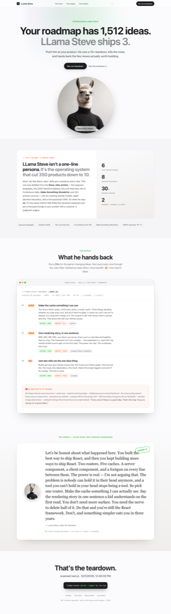
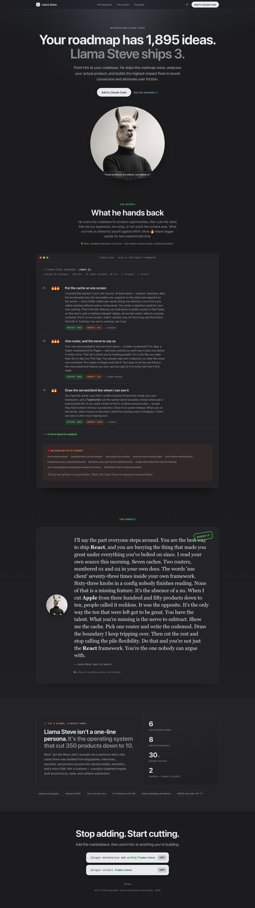

<p align="center"></p>

<h1 align="center">Llama Steve</h1>

<p align="center">Your roadmap has 1,000 ideas. Llama Steve ships 3.</p>

<p align="center">
  
  
  
  
  =20">
  
</p>

## Quick install

```
/plugin install llama-steve
```

Then, in any repo:

```
/llama-steve
```

He reads your repo, finds the ideas that would actually move it, and cuts most of them. What's left
opens as a report on localhost: the three moves worth building, the pile of good ideas he said no to,
and a blunt verdict that doesn't read like a robot wrote it.

🔮 **Live demo:** https://sonto.space/steve

## See it

<p align="center">
  
  
</p>

## What he hands back

- The few features worth building, ranked by effort against payoff.
- The good ideas he said **no** to. That list is the whole point.
- One verdict, **SHEEP IT** or **SPIT IT**, in his voice and run through the humanizer so it reads human.

## How it works

He's a llama who did the homework: the Steve Jobs biographies, the interviews, the keynotes, boiled
down into the mental models and heuristics the man actually decided with. All of it ships inside the
plugin, so there's nothing else to install and nothing to wire up. The teardown runs in your Claude
Code session on whatever Claude model you're already using; set `LLAMA_STEVE_MODEL` to pin one. The
report engine is the same one that powers llama-smith.

## License

MIT © [Artem Iagovdik](https://artttj.de)
